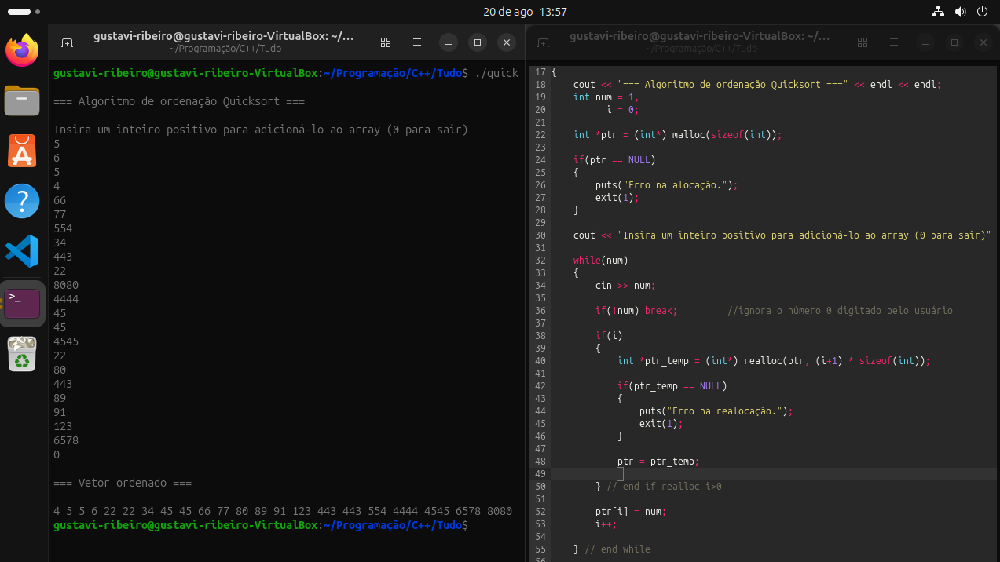

MARKDOWN

# Quicksort com Alocação Dinâmica Expansível em C/C++

Projeto desenvolvido para demonstrar a ordenação de dados utilizando o
algoritmo **Quicksort** integrado ao gerenciamento manual de memória na
Heap em C/C++.

## Sobre o projeto

O programa permite que o usuário insira uma quantidade indefinida de
números inteiros positivos via terminal. A memória é alocada e expandida
dinamicamente conforme a inserção de dados. O processo se encerra ao 
digitar `0`, e em seguida o algoritmo Quicksort ordena os elementos.

## Conceitos Técnicos Aplicados 

- **Alocação Dinâmica (`malloc`/`realloc`):** Expansão do vetor em tempo de execução sem tamanho pré-definido.
- **Tratamento de Ponteiros:** Utilização de ponteiros temporários para evitar *memory leak* em caso de falha na alocação.
- **Algoritmo Quicksort:** Ordenação recursiva por divisão e conquista.
- **Aritmética de Ponteiros:** Acesso e manipulação direta de endereços de memória.

## Como executar 

### Pré-requisitos
Ter o compilador g++ instalado no ambiente Linux

### Compilação e Execução
No terminal, navegue até a pasta do projeto e execute:
```bash
# Compilar o código
g++ src/main.cpp -o quick

# Executar o programa 
./quick

## Demostração


